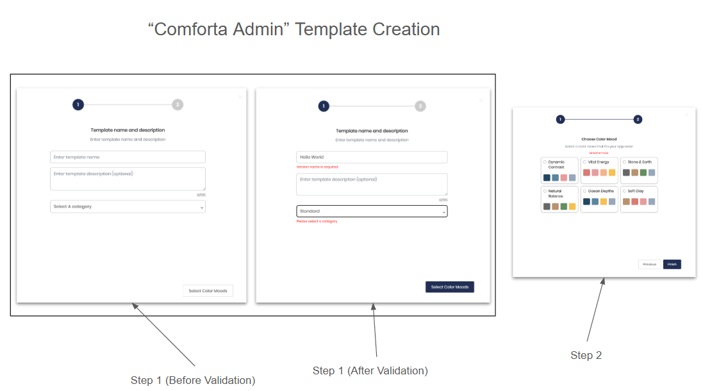
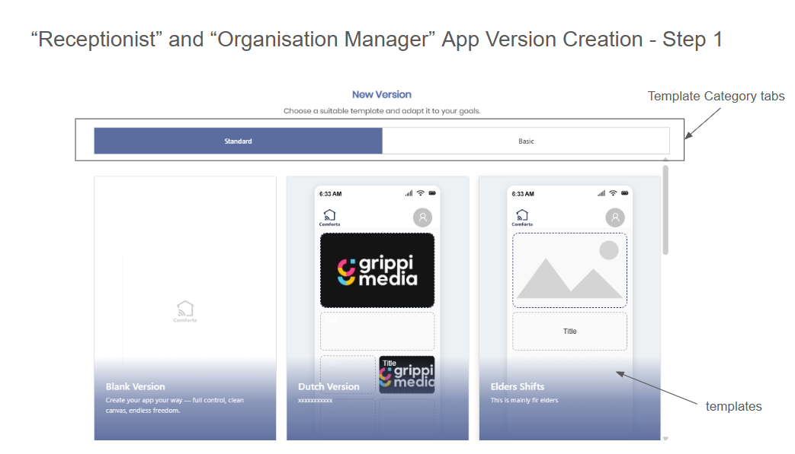

# App Versions & Templates

## Overview

App versions represent the versioned content of a mobile app built in the Comforta platform. They can be created from scratch (blank) or based on a template. Templates are a special class of app version created exclusively by the **Comforta Admin** role.

---

## Roles & Ownership Rules

| Role | `locationid` | `organisationid` |
|---|---|---|
| Comforta Admin (template) | `null` | `null` |
| Organisation Manager | `null` | filled |
| Receptionist | filled | filled |

- **Comforta Admin** creates templates. Templates are app versions with both `locationid` and `organisationid` set to `null`. They are available platform-wide as starting points.
- **Organisation Manager** creates app versions scoped to their organisation (`organisationid` filled, `locationid` null).
- **Receptionist** creates app versions scoped to a specific location within an organisation (both `locationid` and `organisationid` filled).

---

## Database Schema

### `trn_appversion`

```sql
CREATE TABLE IF NOT EXISTS public.trn_appversion
(
    appversionid              character(36)        NOT NULL,
    appversionname            character varying(100) NOT NULL,
    isactive                  boolean              NOT NULL,
    locationid                character(36),                    -- null for Org Manager & Admin
    organisationid            character(36),                    -- null for Admin templates
    isversiondeleted          boolean              NOT NULL,
    versiondeletedat          timestamp without time zone,
    trn_themeid               character(36),
    appversionlanguage        character varying(100) NOT NULL DEFAULT 'en',
    appversionmultilanguages  character varying(400) NOT NULL,
    appversionowner           character varying(40),
    appversionpublishedat     timestamp without time zone,
    appversionthemeid         character(36),
    moodid                    character(36),
    templatecategoryid        character(36),                    -- only set on templates
    appversiondescription     character varying(200) NOT NULL,
    ispublishedtemplate       boolean              NOT NULL,
    CONSTRAINT trn_appversion_pkey PRIMARY KEY (appversionid),
    CONSTRAINT itrn_appversion1 FOREIGN KEY (locationid, organisationid)
        REFERENCES public.trn_location (locationid, organisationid),
    CONSTRAINT itrn_appversion2 FOREIGN KEY (trn_themeid)
        REFERENCES public.trn_theme (trn_themeid),
    CONSTRAINT itrn_appversion3 FOREIGN KEY (appversionthemeid)
        REFERENCES public.trn_theme (trn_themeid),
    CONSTRAINT itrn_appversion4 FOREIGN KEY (templatecategoryid)
        REFERENCES public.trn_templatecategory (templatecategoryid)
)
```

### `trn_templatecategory`

```sql
CREATE TABLE IF NOT EXISTS public.trn_templatecategory
(
    templatecategoryid       character(36)          NOT NULL,
    templatecategoryname     character varying(100) NOT NULL,
    templatecategoryisactive boolean                NOT NULL,
    CONSTRAINT trn_templatecategory_pkey PRIMARY KEY (templatecategoryid)
)
```

---

## Template Creation (Comforta Admin)

Triggered by clicking **"New Template"**. A 2-step modal guides the admin through the process.



### Step 1 — Template Details

Fields:
- **Template name** (required)
- **Template description** (optional, max 200 chars)
- **Template category** (required — dropdown from `trn_templatecategory`)

Validation is run before proceeding. Both name and category must be filled to advance to Step 2.

### Step 2 — Color Mood Selection

The admin selects a **color mood** for the template. A mood is required before finishing.

A mood object has the following shape:

```json
{
    "MoodId": "03791627-a52c-449b-95fb-fc99fa5e3043",
    "MoodName": "Dynamic Contrast",
    "ThemeId": "4ddc1f46-d08a-4c11-9280-0695be8b833f",
    "ThemeName": "Modern",
    "MoodColorNames": "[\"accentColor\",\"backgroundColor\",\"cardTextColor\",\"textColor\"]",
    "MoodColors": [
        {
            "MoodColorId": "11ff4990-4433-4c9d-88f4-fce5645979d1",
            "ColorId": "00000000-0000-0000-0000-000000000000",
            "ColorCode": "#EE6809",
            "ColorName": "primaryColor",
            "MoodColorCode": ""
        },
        {
            "MoodColorId": "a3feee93-d2d8-4ed4-80d7-1d4107d0ad48",
            "ColorId": "00000000-0000-0000-0000-000000000000",
            "ColorCode": "#A72928",
            "ColorName": "cardBgColor",
            "MoodColorCode": ""
        },
        {
            "MoodColorId": "cd42f4d7-cba7-4d2f-bb6a-2c28cc9e7075",
            "ColorId": "00000000-0000-0000-0000-000000000000",
            "ColorCode": "#20639B",
            "ColorName": "backgroundColor",
            "MoodColorCode": ""
        }
    ]
}
```

The selected mood's `MoodId` is stored in `trn_appversion.moodid` and the associated theme in `appversionthemeid`.

---

## App Version Creation (Organisation Manager & Receptionist)

Triggered by clicking **"New Version"**. A modal opens with the following structure:



### Template Selection (Step 1)

- **Tabs** at the top of the modal correspond to template categories from `trn_templatecategory`. Each tab lists the published templates belonging to that category.
- A **"Blank Version"** option is always present (not tied to any category). It gives the user a clean canvas with no pre-existing content.
- Templates are displayed as phone preview cards showing the template's name and description.

The user selects one template (or Blank Version) to base their new app version on.

### Key Differences Between Roles

| Behaviour | Organisation Manager | Receptionist |
|---|---|---|
| `locationid` saved | `null` | filled (their location) |
| `organisationid` saved | filled | filled |
| Scope of version | Organisation-wide | Location-specific |
